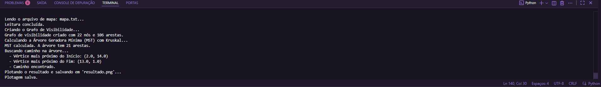

**Prática 2: Grafo de Visibilidade e Navegação de Robôs**

&nbsp;	Este projeto implementa um sistema de planejamento de caminho para um veículo autônomo. O objetivo é criar um Grafo de Visibilidade que conecta a área livre do mapa e, a partir dele, encontrar o caminho de menor custo e seguro entre um ponto de partida (***qstart***) e um ponto de destino (***qgoal***), desviando de obstáculos poligonais.

**1. Instruções de Execução** 

Esta seção detalha os passos necessários para rodar o código main.py e visualizar a solução.

Pré-requisitos:

&nbsp;	-> **Python 3 instalado no sistema.**

Instalação das Dependências

&nbsp;	O script main.py foi configurado para tentar instalar as bibliotecas necessárias automaticamente. Caso a instalação automática falhe, utilize o comando abaixo no seu terminal:

"*pip install shapely networkx matplotlib*"

Execução do Projeto

&nbsp;	O script deve ser executado passando o nome do arquivo de mapa (mapa.txt) como argumento.

"*python main.py mapa.txt*"

**Resultado:**

Após a execução:

&nbsp;	1- O terminal exibirá as coordenadas de início, fim, o caminho encontrado (sequência de vértices) e o custo total.

&nbsp;	2- Uma imagem (roadmap\_path.png) será salva na raiz do projeto, mostrando o Grafo de Visibilidade, a Árvore Geradora Mínima (MST) e o caminho final encontrado.

**2. Análise e Comparativo de Algoritmos**

&nbsp;	Esta seção compara a lógica dos algoritmos implementados no código (***main.py***) com os pseudocódigos de caminho mínimo e AGM apresentados em aula.

&nbsp;	**2.1. Algoritmo para a Árvore Geradora Mínima (AGM)**

&nbsp;	Algoritmo Utilizado: Kruskal (via networkx.minimum\_spanning\_tree).

&nbsp;	**Objetivo**: Gerar uma árvore (MST) que conecta todos os vértices do grafo de visibilidade com o menor custo total possível. Essa árvore minimiza o gasto para percorrer todo o roadmap do ambiente.

Conceito do Pseudocódigo (AGM - Kruskal) - Implementação no Código Python (main.py)

**Ordenação das Arestas** : A biblioteca networkx realiza a ordenação de todas as arestas do Grafo de Visibilidade com base no seu peso. O custo da aresta é a distância euclidiana calculada entre os vértices, usada como critério de ordenação.

**Estrutura Union-Find (Ciclos)**: O algoritmo Kruskal percorre as arestas ordenadas, utilizando a lógica de conjuntos disjuntos (Union-Find) para adicionar arestas de forma que nunca se forme um ciclo, garantindo a propriedade de árvore.

**AGM Resultante**: A função criar\_agm\_kruskal retorna o subgrafo (a árvore) que conecta todos os vértices com o custo total mínimo.

**2.2. Algoritmo de Busca de Caminho Mínimo**

Algoritmo Utilizado: A\* (A-Star) (via networkx.astar\_path).

Objetivo: Encontrar o caminho mais curto entre o vértice inicial (***qstart***) e o vértice final (***qgoal***) dentro da estrutura da AGM.

**Conceito do Pseudocódigo (Dijkstra/A\*):**

**Busca com Heurística** : O networkx.astar\_path() é utilizado. O A\* é uma variação do Dijkstra que adiciona a heurística (distância euclidiana até qgoal) para priorizar a exploração de nós mais promissores, acelerando significativamente a busca.

**Critério de Relaxamento** : O algoritmo opera com os custos ***g*** (custo real do início ao nó atual) e ***h*** (custo estimado do nó atual ao fim). Ele continuamente relaxa as arestas, atualizando o custo total (***f = g + h***) se um caminho mais eficiente for descoberto.

**Custo do Caminho** : O custo final é a soma dos pesos das arestas (distâncias euclidianas) ao longo do caminho mais curto encontrado.

